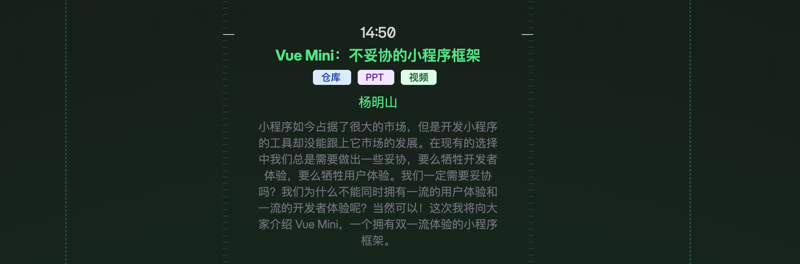
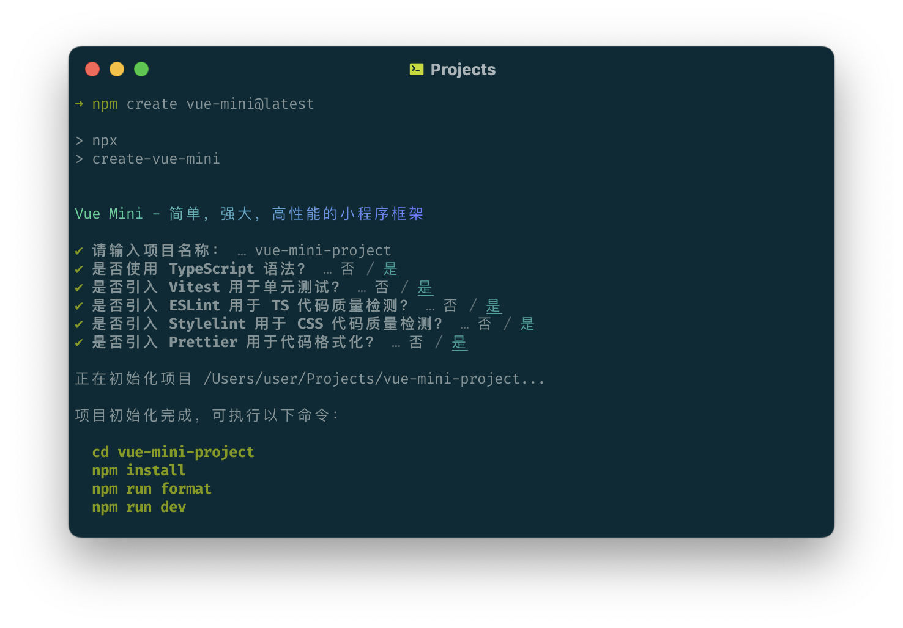
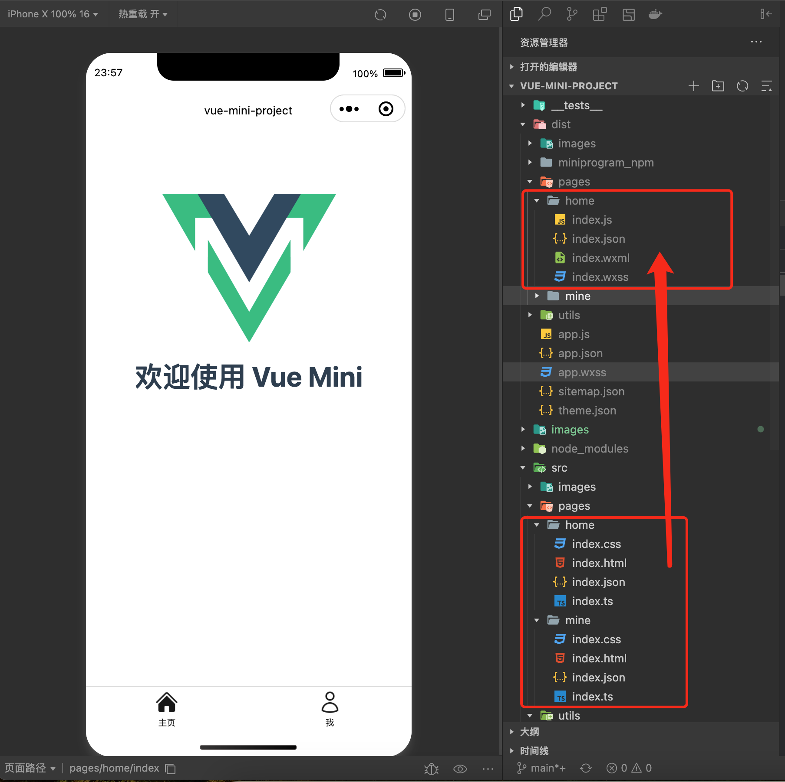
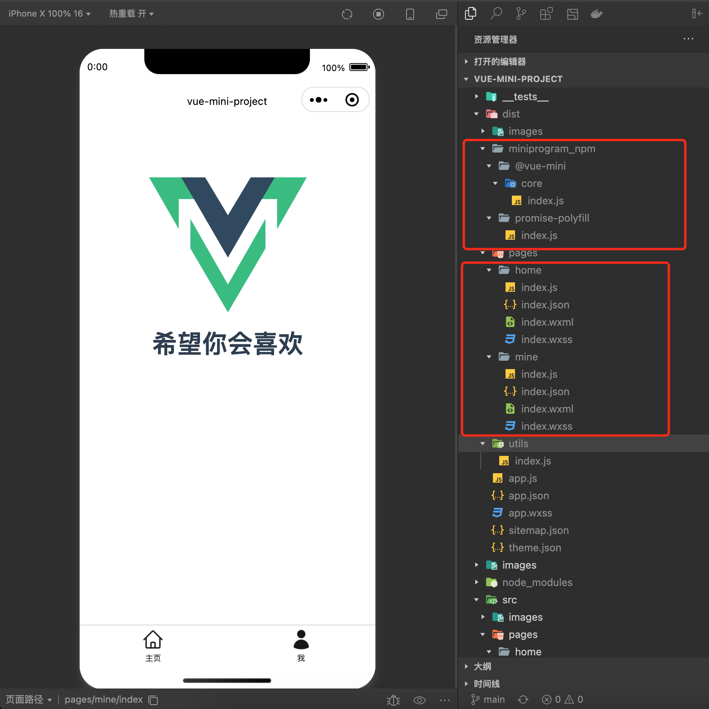

# 开发小程序又一新选择 vue-mini，据说性能是 Taro 的10倍，遥遥领先

## 1. 前言

大家好，我是[若川](https://juejin.cn/user/1415826704971918)，欢迎关注我的[公众号：若川视野](https://mp.weixin.qq.com/s/MacNfeTPODNMLLFdzrULow)。我倾力持续组织了 3 年多[每周大家一起学习 200 行左右的源码共读活动](https://juejin.cn/post/7079706017579139102)，感兴趣的可以[点此扫码加我微信 `ruochuan02` 参与](https://juejin.cn/pin/7217386885793595453)。另外，想学源码，极力推荐关注我写的专栏[《学习源码整体架构系列》](https://juejin.cn/column/6960551178908205093)，目前是掘金关注人数（6k+人）第一的专栏，写有几十篇源码文章。

刚刚结束不久的[vueconf 深圳](https://vueconf.cn)

有一个主题《Vue-mini 不妥协的小程序框架》



[仓库](https://github.com/yangmingshan/slides)、[PPT](https://feday.fequan.com/vueconf24/mingshan_VueConf%20CN%202024.pdf)、[视频](https://www.bilibili.com/video/BV1J4421D7ja/)

本文主要来体验下 [vue-mini](https://vuemini.org/)，并且学习下基本的打包构建大概是咋样实现的。

学完本文，你将学到：

```bash
1. vue-mini 初体验
2.
```

## 初始化项目

- 目前结构
- 打包后目录结构
- 对比taro打包后的目录结构
- build.js 分析
-

根据官网文档生成小程序项目，我采用的是 `pnpm create vue-mini@lastest`



调用的是[create-vue-mini](https://github.com/vue-mini/create-vue-mini)这个项目。它由 [create-vue](https://github.com/vuejs/create-vue) 修改而来。我在21年写过它的源码文章[Vue 团队公开快如闪电的全新脚手架工具 create-vue，未来将替代 Vue-CLI，才300余行代码，学它！](https://juejin.cn/post/7018344866811740173)，(3.9w+阅读量、483赞)可供学习。

```bash
pnpm run dev
```

```bash
pnpm run build
```

将此项目导入微信开发者工具时请选择项目根目录而非 `dist` 目录。

打开项目如图：





>"dev": "cross-env NODE_ENV=development node build.js",
>"build": "cross-env NODE_ENV=production node build.js"

[cross-env](https://www.npmjs.com/package/cross-env) 是用来跨平台设置环境变量的，`NODE_ENV=development` 代表开发环境，`NODE_ENV=production` 代表生产环境。

## build.js

```ts
// 引入 node path 模块和 process 模块
import path from 'node:path';
import process from 'node:process';

import fs from 'fs-extra';
import chokidar from 'chokidar';
import babel from '@babel/core';
import traverse from '@babel/traverse';
import t from '@babel/types';
import { minify } from 'terser';
import postcss from 'postcss';
import postcssrc from 'postcss-load-config';
import { rollup } from 'rollup';
import replace from '@rollup/plugin-replace';
import terser from '@rollup/plugin-terser';
import resolve from '@rollup/plugin-node-resolve';
import commonjs from '@rollup/plugin-commonjs';
import { green, bold } from 'kolorist';
```

>引入 node path 模块和 process 模块
>引入 fs-extra 模块，用来操作文件和目录
>引入 chokidar 模块，用来监听文件变化
>引入 babel 模块，用来编译 js 代码
>引入 traverse 模块，用来遍历 js 代码
>引入 t 模块，用来编译 js 代码
>引入 terser 模块，用来压缩 js 代码
>引入 postcss 模块，用来编译 css 代码
>引入 postcssrc 模块，用来加载 postcss 配置文件
>引入 rollup 模块，用来打包 js 代码
>引入 replace 模块，用来替换代码
>引入 terser 模块，用来压缩 js 代码
>引入 resolve 模块，用来解析 node_modules 中的依赖
>引入 commonjs 模块，用来解析 commonjs 依赖
>引入 [kolorist](https://www.npmjs.com/package/kolorist) 模块，用来输出彩色文字
>引入 rollup-plugin-terser 模块，用来压缩 js 代码
>引入 rollup-plugin-commonjs 模块，用来解析 commonjs 依赖

### 定义变量

```js
let waitList = [];
const startTime = Date.now();
// 区分开发环境和生产环境
const NODE_ENV = process.env.NODE_ENV || 'production';
// 生产环境
const __PROD__ = NODE_ENV === 'production';
const terserOptions = {
  ecma: 2016,
  toplevel: true,
  safari10: true,
  format: { comments: false },
};

const bundledModules = new Set();
```

调试

### 调用 prod 或者 dev

```js
if (__PROD__) {
  await prod();
} else {
  await dev();
}
```

### prod

```js
async function prod() {
  await fs.remove('dist');
  const watcher = chokidar.watch(['src'], {
    ignored: ['**/.{gitkeep,DS_Store}'],
  });
  watcher.on('add', (filePath) => {
    const promise = cb(filePath);
    waitList.push(promise);
  });
  watcher.on('ready', async () => {
    const promise = watcher.close();
    waitList.push(promise);
    await Promise.all(waitList);
    console.log(bold(green(`构建完成，耗时：${Date.now() - startTime}ms`)));
  });
}
```

### dev

```js
async function dev() {
  await fs.remove('dist');
  chokidar
    .watch(['src'], {
      ignored: ['**/.{gitkeep,DS_Store}'],
    })
    .on('add', (filePath) => {
      const promise = cb(filePath);
      waitList?.push(promise);
    })
    .on('change', (filePath) => {
      cb(filePath);
    })
    .on('ready', async () => {
      await Promise.all(waitList);
      console.log(bold(green(`启动完成，耗时：${Date.now() - startTime}ms`)));
      console.log(bold(green('监听文件变化中...')));
      // Release memory.
      waitList = null;
    });
}
```

我们接着来看，`cb` 函数，这个函数用来处理文件变化。

```js
const cb = async (filePath) => {
  if (/\.ts$/.test(filePath)) {
    await processScript(filePath);
    return;
  }

  if (/\.html$/.test(filePath)) {
    await processTemplate(filePath);
    return;
  }

  if (/\.css$/.test(filePath)) {
    await processStyle(filePath);
    return;
  }

  await fs.copy(filePath, filePath.replace('src', 'dist'));
};
```

`cb` 函数主要用来处理 `ts、html、css` 文件和复制文件到 `dist` 目录。

`processScript` 处理 `ts` 文件

### processScript 处理 ts

```js
async function processScript(filePath) {
  let ast, code;
  try {
    const result = await babel.transformFileAsync(path.resolve(filePath), {
      ast: true,
    });
    ast = result.ast;
    code = result.code;
  } catch (error) {
    console.error(`Failed to compile ${filePath}`);

    if (__PROD__) throw error;

    console.error(error);
    return;
  }

  if (filePath.endsWith('app.ts')) {
    /**
     * IOS 小程序 Promise 使用的内置的 Polyfill，但这个 Polyfill 有 Bug 且功能不全，
     * 在某些情况下 Promise 回调不会执行，并且不支持 Promise.prototype.finally。
     * 这里将全局的 Promise 变量重写为自定义的 Polyfill，如果你不需要兼容 iOS10 也可以使用以下方式：
     * Promise = Object.getPrototypeOf((async () => {})()).constructor;
     * 写在此处是为了保证 Promise 重写最先被执行。
     */
    code = code.replace(
      '"use strict";',
      '"use strict";\n\nvar PromisePolyfill = require("promise-polyfill");\nPromise = PromisePolyfill.default;',
    );
    const promise = bundleModule('promise-polyfill');
    waitList?.push(promise);
  }

  traverse.default(ast, {
    CallExpression({ node }) {
      if (
        node.callee.name !== 'require' ||
        !t.isStringLiteral(node.arguments[0]) ||
        node.arguments[0].value.startsWith('.')
      ) {
        return;
      }

      const promise = bundleModule(node.arguments[0].value);
      waitList?.push(promise);
    },
  });

  if (__PROD__) {
    code = (await minify(code, terserOptions)).code;
  }

  const destination = filePath.replace('src', 'dist').replace(/\.ts$/, '.js');
  // Make sure the directory already exists when write file
  await fs.copy(filePath, destination);
  await fs.writeFile(destination, code);
}
```

#### babel.config.js

```js
import fs from 'node:fs';

const runtimeVersion = JSON.parse(
  fs.readFileSync(
    new URL(import.meta.resolve('@babel/runtime/package.json')),
    'utf8',
  ),
).version;

const config = {
  targets: {},
  assumptions: {
    arrayLikeIsIterable: true,
    constantReexports: true,
    constantSuper: true,
    enumerableModuleMeta: true,
    ignoreFunctionLength: true,
    ignoreToPrimitiveHint: true,
    iterableIsArray: true,
    mutableTemplateObject: true,
    noClassCalls: true,
    noDocumentAll: true,
    noNewArrows: true,
    objectRestNoSymbols: true,
    privateFieldsAsProperties: true,
    pureGetters: true,
    setClassMethods: true,
    setComputedProperties: true,
    setPublicClassFields: true,
    setSpreadProperties: true,
    skipForOfIteratorClosing: true,
    superIsCallableConstructor: true,
  },
  presets: [
    [
      '@babel/preset-env',
      {
        bugfixes: true,
        modules: 'commonjs',
      },
    ],
    '@babel/preset-typescript',
  ],
  plugins: [
    [
      '@babel/plugin-transform-runtime',
      {
        version: runtimeVersion,
      },
    ],
    'transform-inline-environment-variables',
    [
      'module-resolver',
      {
        alias: {
          '@': './src',
        },
      },
    ],
    'autocomplete-index',
  ],
};

export default config;
```

### bundleModule 打包模块

```js
async function bundleModule(module) {
  if (bundledModules.has(module)) return;
  bundledModules.add(module);

  const bundle = await rollup({
    input: module,
    plugins: [
      commonjs(),
      replace({
        preventAssignment: true,
        values: {
          'process.env.NODE_ENV': JSON.stringify(NODE_ENV),
        },
      }),
      resolve(),
      __PROD__ && terser(terserOptions),
    ].filter(Boolean),
  });
  await bundle.write({
    exports: 'named',
    file: `dist/miniprogram_npm/${module}/index.js`,
    format: 'cjs',
  });
}
```

如果已经有打包好的模块，直接返回。
用 `rollup` 打包模块，处理成 `commonjs`，并写入 `dist/miniprogram_npm` 目录。

我们继续来看 `html` 文件处理

### processTemplate 处理模板 html

```js
async function processTemplate(filePath) {
  const destination = filePath
    .replace('src', 'dist')
    .replace(/\.html$/, '.wxml');
  await fs.copy(filePath, destination);
}
```

复制 `src` `html` 文件 修改后缀名为 `.wxml` 文件到 `dist` 目录。

### processStyle 处理样式文件

```js
async function processStyle(filePath) {
  const source = await fs.readFile(filePath, 'utf8');
  const { plugins, options } = await postcssrc({ from: undefined });

  let css;
  try {
    const result = await postcss(plugins).process(source, options);
    css = result.css;
  } catch (error) {
    console.error(`Failed to compile ${filePath}`);

    if (__PROD__) throw error;

    console.error(error);
    return;
  }

  const destination = filePath
    .replace('src', 'dist')
    .replace(/\.css$/, '.wxss');
  // Make sure the directory already exists when write file
  await fs.copy(filePath, destination);
  await fs.writeFile(destination, css);
}
```

[postcss-load-config](https://github.com/postcss/postcss-load-config#readme) `Autoload Config for PostCSS` 是自动加载 `postcss.config.js` 等配置文件，并解析其中的插件。
然后调用 `postcss` 解析样式文件，并写入 `dist` 目录。

```js
// postcss.config.js
import pxtorpx from 'postcss-pxtorpx-pro';

const config = {
  plugins: [pxtorpx({ transform: (x) => x })],
};

export default config;
```

[postcss-pxtorpx-pro](https://github.com/Genuifx/postcss-pxtorpx-pro#readme)

```css
// input
h1 {
    margin: 0 0 20px;
    font-size: 32px;
    line-height: 1.2;
    letter-spacing: 1px;
}

// output
h1 {
  margin: 0 0 40rpx;
  font-size: 64rpx;
  line-height: 1.2;
  letter-spacing: 2rpx;
}
```

----

**如果看完有收获，欢迎点赞、评论、分享、收藏支持。你的支持和肯定，是我写作的动力**。

作者：常以**若川**为名混迹于江湖。所知甚少，唯善学。[若川的博客](https://ruochuan12.github.io)

最后可以持续关注我[@若川](https://juejin.cn/user/1415826704971918)，欢迎关注我的[公众号：若川视野](https://mp.weixin.qq.com/s/MacNfeTPODNMLLFdzrULow)。我倾力持续组织了 3 年多[每周大家一起学习 200 行左右的源码共读活动](https://juejin.cn/post/7079706017579139102)，感兴趣的可以[点此扫码加我微信 `ruochuan02` 参与](https://juejin.cn/pin/7217386885793595453)。另外，想学源码，极力推荐关注我写的专栏[《学习源码整体架构系列》](https://juejin.cn/column/6960551178908205093)，目前是掘金关注人数（6k+人）第一的专栏，写有几十篇源码文章。
